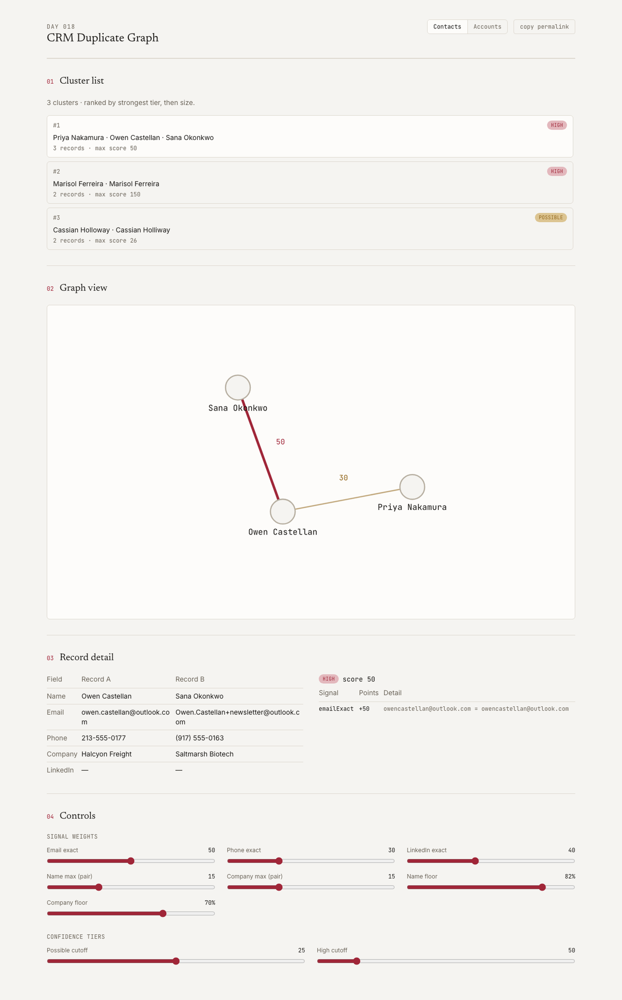
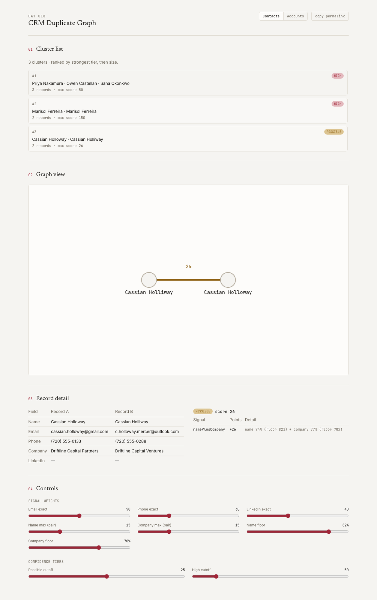

# CRM Duplicate Graph

A CRM dedupe tool that shows the receipt for every match — which signal fired, how many points it earned, and why the cluster is a real transitive chain and not just a list of pairs.

**[Live demo](https://crm-duplicate-graph.vercel.app)** · [Plain-English guide](docs/plain-english-guide.md) · [`POST /api/v1/dedupe`](https://crm-duplicate-graph.vercel.app/api/schema) · [Plan](./PLAN.md) · Day 018 of a 100-day building challenge



Opens on a 2,000-contact / 500-account synthetic corpus with default weights, tiers, and clusters already computed. No upload, no sign-up, no key.

> The corpus is synthetic, seeded, and committed, with four named pathologies planted on purpose — in **both** contacts and accounts — and asserted by tests. There are **zero model calls**: every score is a documented deterministic formula, and `npm run sweep` checks nine cross-configuration invariants in under half a second.

## Why I Built This

CRM dedupe tools exist. Most of them fail the same four ways.

**A match score with no receipt isn't trusted.** "87% match" tells an admin nothing about *why* — email, phone, a fuzzy name guess? Without the breakdown, a human either blindly accepts every flagged pair or blindly ignores all of them.

**Duplicates aren't pairs, they're clusters, and pairwise tools miss the chain.** Record A and B share a phone. B and C share an email. A and C share nothing directly. A tool that only compares pairs reports two disconnected "maybe" flags; the graph — connected components over a match graph, not a list of pairs — is the only structure that gets this right natively.

**Aggressive fuzzy matching creates false positives, and a false merge destroys data.** A responsible tool has to show it can hold a precision floor: two clearly-similar records *correctly* refused a match because the corroborating signals disagree.

**Naive all-pairs comparison doesn't scale, and blocking is usually a silent, unverified assumption.** Real CRMs have hundreds of thousands of records; comparing every pair is O(n²). Tools add a blocking prefilter to cut the comparison set, but almost never check whether it silently drops a true duplicate.

This repo's subject is those four gaps.

## What It Does

**A four-section console, one page.** Cluster list (contact/account toggle, ranked by strongest tier then size) → graph view (force-directed, click an edge) → record detail (side-by-side fields) → the full scoring receipt, every signal that fired and its point contribution.

**Two entity types, fully independent.** Contacts and accounts are two separate dedupe problems, run and displayed separately — a contact's `company` field is free text, never a foreign key into the accounts table.

**Every weight, floor, and tier cutoff is live and client-side.** Drag a slider and watch clusters recompute instantly — including watching a borderline cluster cross in or out of the Possible tier as a fuzzy floor moves. Tier sliders are cross-clamped so the UI can never construct an inverted config.

**Multi-key blocking, checked against brute force.** Naive all-pairs is never run against the full corpus. Blocking cuts contact comparisons to candidates from **1,999,000 possible pairs down to 2,712 (0.14%)**, accounts from 124,750 down to 2,592 (2.1%) — and `npm run sweep` verifies that reduction never drops a true match, on a held-out sample checked against real brute-force scoring.

## Demo

### THE TWINS — an exact duplicate, both tiers agree


Same person, entered twice, with realistic formatting noise: `+work` tag on the email, a different phone format, `Kestrel Ironworks Inc` vs `kestrel ironworks inc.`. Four independent signals fire — `emailExact`, `phoneExact`, `linkedinExact`, and the joint `namePlusCompany` pair — for a score of **150**, clear of the high cutoff (50) with enormous margin. No ambiguity, and the receipt shows exactly why.

### THE CHAIN — clustering is connected components, not pairs

*(the hero screenshot above)*

Three contacts: A and B share a phone (score 30, `possible`); B and C share an email (score 50, `high`); A and C share **nothing** — score 0, no edge at all. A pairwise tool reports two disconnected "maybe" flags. This tool's union-find clustering puts all three in one cluster anyway, because A connects to C *through* B — transitive by construction, not asserted.

### THE IMPOSTER — a precision trap, correctly refused

Two different people: **Jonathan Reyes** and **Jonathon Reyes** — a one-letter name difference, 92.9% similar, comfortably over the 82% name floor on its own. A name-only fuzzy matcher would flag this pair immediately. But their companies (`Anchorpoint Legal` vs `Vesper Media Group`) are only 11.1% similar, nowhere near the 70% company floor — and the joint-pair rule requires **both** floors to clear together, or the pair signal contributes nothing. Score: **0**. No edge, no cluster, no false merge. The account-side version of this trap ("Meridian Systems" vs "Meridian Solutions", sharing a prefix, 66.7% similar) is refused the same way — accounts score name and address as independent signals rather than a joint pair, and 66.7% still doesn't clear the 80% account name floor.

### THE GHOST — the tier cutoff is a real, visible line



A sparse record with only one signal available — a name/company pair sitting right at the boundary. Score: **26**, one point above the `possible` cutoff of 25. Drag the Possible-cutoff slider from 25 to 26 or higher in the live console and watch this exact cluster disappear from the list in real time — the cutoff isn't a fudge, it's a line you can watch a real record cross.

## How It Works

```
data/            corpus generation + committed JSON + zod load schema
  ↓
lib/domain/      Contact, Account, SignalWeights, ConfidenceTiers, Config — types + zod
  ↓
lib/match/       normalization, similarity, blocking, pairwise scoring + receipts
  ↓
lib/graph/       union-find clustering, cluster ranking/tiering
  ↓
app/             console (RSC where possible) + /api/v1/dedupe
```

`lib/compute.ts` wires the last two layers into one `Config -> DedupeResult` function, used by the sweep script, the API route, and the console's live client-side recompute — nothing above it recomputes a score or a cluster independently.

**Scoring.** Contact score is `emailExact + phoneExact + linkedinExact + pairScore`, where `pairScore` is a single joint signal — it fires only when *both* a fuzzy name floor (82%) and a fuzzy company floor (70%) clear together, worth up to 30 points (`name% × 15 + company% × 15`). Account score is `domainExact + phoneExact + nameScore + addressScore` — name and address are independent signals here, each contributing on its own once it clears its own floor, because a strong address match alone is real corroborating evidence for a business in a way a bare name match isn't for a person. Similarity is `1 - levenshtein(a, b) / max(len(a), len(b), 1)`, via `fastest-levenshtein` — a small, well-maintained edit-distance primitive, not a black-box matcher.

**Blocking.** Every record lands in a handful of cheap-key buckets (normalized email, last-6 phone digits, a name-prefix key, a normalized LinkedIn slug for contacts; domain, last-6 phone digits, a name-prefix key for accounts). Only records sharing at least one bucket are ever scored against each other.

**Clustering.** Union-find over the candidate pairs that clear the `possible` floor. Every connected component with 2+ records is a cluster — transitive by construction, which is exactly what THE CHAIN demonstrates.

### The sweep

`npm run sweep` — 29,000+ checks across a cross-product of configs, in under half a second, no network. Nine invariants: determinism, weight monotonicity, tier-threshold monotonicity, floor monotonicity, score symmetry, cluster partition, contact/account isolation, blocking completeness against brute force, and pathology persistence through the real match+cluster pipeline.

Running it against the real corpus caught three genuine corpus-generation bugs before this repo shipped — a random background contact drawing the same LinkedIn slug as another, a random name colliding with a pathology's own identity, and two differently-disambiguated company names landing close enough to cross the fuzzy floor by accident. Each is fixed at the source (not papered over) and described in the `feat(app)` and `test` commits.

## The numbers this tool refuses to fake

- **A bare match score with no breakdown.** Every displayed edge ships with its full signal-by-signal receipt, or it doesn't ship.
- **A cluster that's really just a pairwise list.** Clusters come from real union-find connected components — THE CHAIN's A and C are in the same cluster with zero direct evidence between them, which a pairwise tool cannot produce.
- **A blocking prefilter nobody checked.** `npm run sweep`'s invariant 8 diffs blocking's candidate set against real brute-force scoring on a held-out sample — if blocking ever silently dropped a true match, the sweep would fail, not the demo.
- **A crash on a degenerate config.** All-zero weights produce a named "no clusters" empty state; an inverted tier request is a rejected 400 with a readable zod issue, never an exception.

## Tradeoffs, and what is arbitrary

**The signal weights are defaults, not a calibrated model.** 50 points for an exact email match, 15 for a joint name+company pair — these are hand-set, documented, and fully adjustable on screen and via the API. The claim isn't that these numbers are universally correct; it's that the formula is fixed, transparent, and auditable line by line, unlike a black-box match score.

**Normalization is US-only, named as a scope limit.** Phone normalization assumes the last 10 digits are meaningful; address normalization only canonicalizes English street-suffix abbreviations (street/st, avenue/ave, road/rd, boulevard/blvd). A real internationalization pass is a materially different, harder problem — scoped out for a one-day build, not silently ignored.

**No cross-entity resolution.** A contact's `company` field is never used to look up or corroborate against an account record. Linking "this contact" to "its account" is a different, harder problem this repo doesn't claim to solve.

**The corpus is synthetic.** Every claim here is about *structure* — explainable scoring, transitive clustering, a real precision floor, blocking correctness — and structure is a property of the shape of a match graph, not of whose name is on the record. The generator (`data/generate.ts`) is committed, the seed is fixed, and `npm run corpus` regenerates the exact same file.

## Run it locally

```bash
npm install
npm run dev         # console at localhost:3000

npm test            # unit tests, including all four pathology assertions
npm run sweep       # nine invariants over a cross-product, no network
npm run typecheck
npm run lint
npm run build

npm run corpus      # regenerate the committed corpus (must be byte-identical)
```

No environment variables, no secrets, no runtime network calls — the corpus is committed, so the deployment is static plus pure compute.

## Repo map

| path | what lives there |
|---|---|
| [`PLAN.md`](./PLAN.md) | the contract — 17 decisions settled before any code was written |
| [`data/generate.ts`](./data/generate.ts) | the corpus generator, four pathologies planted in named passes, in both entity types |
| [`lib/match/scoring.ts`](./lib/match/scoring.ts) | the pairwise scoring formulas + per-signal receipts |
| [`lib/graph/cluster.ts`](./lib/graph/cluster.ts) | union-find connected-components clustering |
| [`lib/compute.ts`](./lib/compute.ts) | the single `Config -> DedupeResult` pipeline composition |
| [`scripts/sweep.mts`](./scripts/sweep.mts) | the nine invariants |
| [`app/console/`](./app/console/) | the four-section console |

## Licence

MIT.
